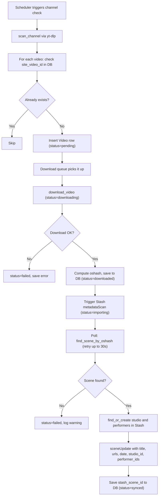

# ytdl-stash: Full Build Roadmap

## Tech Stack

- **Runtime**: Python 3.12
- **Framework**: FastAPI + Uvicorn
- **Frontend**: Jinja2 templates + HTMX (no build step)
- **Database**: SQLite via SQLAlchemy (async with aiosqlite)
- **Downloader**: yt-dlp (Python library import)
- **Scheduler**: APScheduler 3.x
- **HTTP Client**: httpx (async, for Stash GraphQL)
- **Container**: Docker + docker-compose

---

## Phase 1: Project Scaffold and Configuration

Set up the project skeleton, dependency management, Docker scaffolding, and a configuration system.

**Files to create:**

- `requirements.txt` — pinned dependencies: fastapi, uvicorn, sqlalchemy, aiosqlite, yt-dlp, apscheduler, httpx, jinja2, python-multipart
- `Dockerfile` — Python 3.12-slim base, install ffmpeg, copy app, run uvicorn
- `docker-compose.yml` — service definition with volume mounts and env vars
- `app/__init__.py`
- `app/main.py` — FastAPI app factory, mount static/templates, include routers, startup/shutdown events
- `app/config.py` — Pydantic `BaseSettings` class reading from env vars:

```python
class Settings(BaseSettings):
    stash_url: str = "http://localhost:9999"
    stash_api_key: str = ""
    download_dir: str = "/downloads"
    data_dir: str = "/app/data"       # SQLite lives here
    default_check_interval_hours: int = 6
    download_delay_seconds: int = 5   # rate limit between downloads
    cookies_file: str | None = None   # optional cookies.txt path
    ytdlp_output_template: str = "%(uploader)s - %(title)s [%(id)s].%(ext)s"

    class Config:
        env_prefix = "YTDL_"
```

---

## Phase 2: Database Models

SQLAlchemy async models with SQLite. Two tables: `channels` and `videos`.

**Files to create:**

- `app/database.py` — async engine, sessionmaker, `Base`, `get_db` dependency, `init_db()` that calls `create_all`
- `app/models.py`:

**Channel model:**

- `id`: Integer PK
- `name`: String (display name)
- `url`: String (channel/model/user page URL)
- `site`: String (e.g. "pornhub", "xvideos" — derived from URL)
- `enabled`: Boolean, default True
- `check_interval_hours`: Integer
- `last_checked_at`: DateTime, nullable
- `created_at`: DateTime
- `updated_at`: DateTime

**Video model:**

- `id`: Integer PK
- `channel_id`: Integer FK to channels
- `site_video_id`: String, unique (video ID from the source site, e.g. yt-dlp `id` field)
- `title`: String
- `url`: String
- `upload_date`: Date, nullable
- `performers`: JSON (list of strings)
- `studio`: String, nullable
- `duration_seconds`: Integer, nullable
- `thumbnail_url`: String, nullable
- `original_filename`: String, nullable (filename at download time)
- `oshash`: String, nullable (computed after download, before Stash scan)
- `status`: String (pending / downloading / downloaded / importing / synced / failed)
- `error_message`: String, nullable
- `stash_scene_id`: String, nullable (Stash scene ID after sync)
- `metadata_json`: Text, nullable (raw yt-dlp info_dict dump)
- `created_at`: DateTime
- `updated_at`: DateTime

**Indexes:** unique on `site_video_id`, index on `status`, index on `channel_id`.

---

## Phase 3: yt-dlp Downloader Module

Wraps yt-dlp as a Python library for two operations: channel scanning and video downloading.

**File to create:** `app/downloader.py`

**Function: `scan_channel(url, cookies_file) -> list[dict]**`

- Uses `yt_dlp.YoutubeDL` with `extract_flat=True` to get the list of video entries from a channel/model/user URL
- Returns list of dicts with: `id`, `title`, `url`, `upload_date`, `uploader`, `duration`, `thumbnail`
- Does NOT download anything

**Function: `download_video(url, output_dir, output_template, cookies_file) -> dict**`

- Downloads a single video
- Extracts full metadata via yt-dlp info_dict
- Parses performers from metadata fields (yt-dlp provides `categories`, `tags`, `cast` depending on extractor)
- Returns dict with: `filepath`, `filename`, `title`, `upload_date`, `performers`, `studio`, `duration`, `thumbnail_url`, `metadata_json`

**Function: `compute_oshash(filepath) -> str**`

- OpenSubtitles hash algorithm (same as Stash uses)
- Reads first and last 64KB of the file, computes the hash
- Returns 16-char hex string

---

## Phase 4: Stash GraphQL Client

Async client using httpx to communicate with Stash's GraphQL API at `{stash_url}/graphql`.

**File to create:** `app/stash_client.py`

**Class: `StashClient**`

- Constructor takes `url` and `api_key`
- All methods are async

**Methods:**

1. `trigger_scan(paths: list[str])` — calls `metadataScan` mutation
2. `find_scene_by_oshash(oshash: str) -> dict | None` — queries `findScenes` filtering by file fingerprint oshash; returns scene dict or None
3. `find_performer(name: str) -> str | None` — queries `findPerformers` by exact name match; returns performer ID or None
4. `create_performer(name: str) -> str` — calls `performerCreate` mutation; returns new performer ID
5. `find_or_create_performer(name: str) -> str` — combines the above two
6. `find_studio(name: str) -> str | None` — queries `findStudios` by name
7. `create_studio(name: str) -> str` — calls `studioCreate`
8. `find_or_create_studio(name: str) -> str` — combines the above two
9. `update_scene(scene_id, title, urls, date, studio_id, performer_ids)` — calls `sceneUpdate` mutation
10. `health_check() -> bool` — simple query to verify connectivity

---

## Phase 5: Download-to-Stash Pipeline

The core orchestration logic that ties downloading and Stash integration together.

**File to create:** `app/pipeline.py`




**Key implementation details:**

- Downloads run sequentially (one at a time) with a configurable delay between them to avoid rate limiting
- oshash is computed immediately after download, before triggering the scan
- Stash scene lookup polls every 2 seconds for up to 30 seconds (configurable) to allow Stash time to process the scan
- Failed videos can be retried from the UI

---

## Phase 6: Scheduler

Periodic job that checks each enabled channel on its configured interval.

**File to create:** `app/scheduler.py`

- Uses APScheduler `AsyncIOScheduler`
- On app startup, schedule a master job that runs every 60 seconds
- The master job queries all enabled channels where `last_checked_at` is older than their `check_interval_hours`
- For each due channel, runs the scan + queue logic from the pipeline
- A separate job (or the same loop) processes pending downloads one by one
- Scheduler starts/stops via FastAPI lifespan events

---

## Phase 7: API Routes

REST-ish routes for the web UI to consume (rendered via Jinja2 + HTMX).

**Files to create:**

- `app/routes/__init__.py`
- `app/routes/channels.py`:
  - `GET /channels` — list all channels (template render)
  - `POST /channels` — add a new channel (form submit)
  - `PUT /channels/{id}` — update channel (name, interval, enabled toggle)
  - `DELETE /channels/{id}` — remove channel and optionally its videos
  - `POST /channels/{id}/check-now` — trigger an immediate scan for a channel
- `app/routes/videos.py`:
  - `GET /videos` — list videos with filtering (by channel, by status)
  - `GET /videos/{id}` — video detail (shows metadata, Stash link)
  - `POST /videos/{id}/retry` — retry a failed download
  - `DELETE /videos/{id}` — remove video record
- `app/routes/settings.py`:
  - `GET /settings` — settings page (shows Stash connection status, config)
  - `POST /settings/test-stash` — test Stash connectivity
- `app/routes/dashboard.py`:
  - `GET /` — dashboard with stats: total channels, total videos, recent downloads, pending queue, failed count

---

## Phase 8: Web UI (Jinja2 + HTMX)

Simple, functional UI. No JavaScript framework, just server-rendered HTML enhanced with HTMX for interactive bits.

**Files to create:**

- `app/templates/base.html` — layout with nav (Dashboard, Channels, Videos, Settings), uses a minimal CSS framework (Pico CSS or Simple.css for clean defaults)
- `app/templates/dashboard.html` — stats cards, recent activity list
- `app/templates/channels/list.html` — table of channels with enable/disable toggle, check-now button, last checked time
- `app/templates/channels/add.html` — form: URL input, name, check interval
- `app/templates/videos/list.html` — table with status badges, filtering by channel/status, link to Stash scene
- `app/templates/videos/detail.html` — full metadata view, Stash link, retry button if failed
- `app/templates/settings.html` — Stash connection test, app info
- `app/static/style.css` — minimal custom overrides if needed

HTMX usage:

- Channel enable/disable toggle via `hx-put`
- "Check Now" button via `hx-post` with loading indicator
- "Retry" button on failed videos via `hx-post`
- Auto-refresh video list via `hx-trigger="every 10s"` for live status updates

---

## Phase 9: Docker and Deployment

`**Dockerfile`:**

```
FROM python:3.12-slim
RUN apt-get update && apt-get install -y ffmpeg && rm -rf /var/lib/apt/lists/*
WORKDIR /app
COPY requirements.txt .
RUN pip install --no-cache-dir -r requirements.txt
COPY app/ app/
CMD ["uvicorn", "app.main:app", "--host", "0.0.0.0", "--port", "8000"]
```

`**docker-compose.yml`:**

- ytdl-stash service on port 8282:8000
- Volume: `./data:/app/data` (SQLite persistence)
- Volume: shared path with Stash for `/downloads`
- Environment variables for all `YTDL_*` settings
- Optional: cookies.txt bind mount

---

## Phase 10: Polish and Hardening

- Logging throughout (Python `logging` module, structured output)
- Error handling in the pipeline (graceful retries, clear error messages saved to DB)
- Alembic for future DB migrations (optional but recommended)
- Health check endpoint for Docker (`GET /health`)
- Graceful shutdown (drain downloads, stop scheduler)
- README.md with setup instructions, docker-compose example, configuration reference

